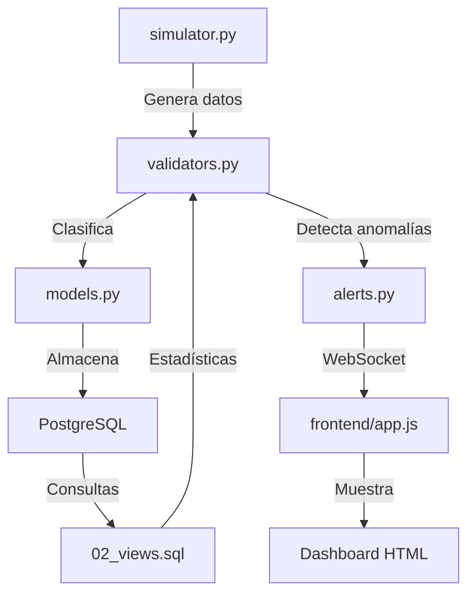
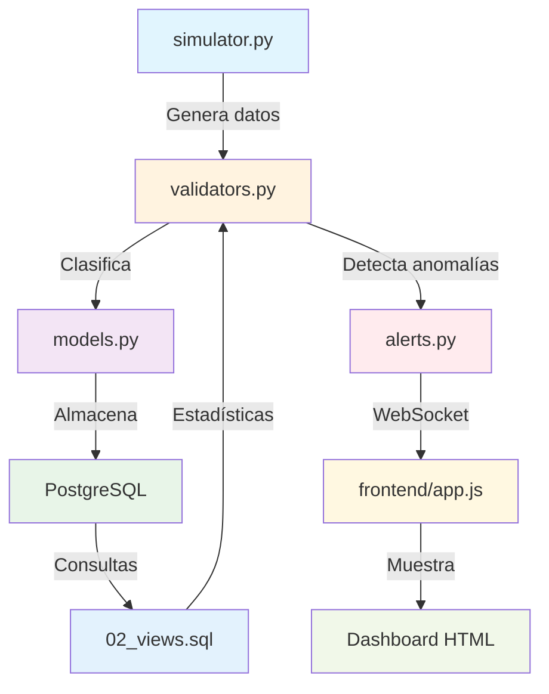

# ⚡ ERCO Energy Monitor

Sistema de monitoreo en tiempo real para inversores solares con validación automática de datos y detección de anomalías.

## 🚀 Inicio Rápido

### Prerrequisitos
- Docker Desktop
- Git
- Puertos 80, 8000 y 5432 disponibles

### Instalación

# Clonar repositorio
git clone https://github.com/JMoneda/Prueba_Erco.git

# Ubicarse en la raíz del proyecto
cd ruta/erco-energy-monitor

# Generar SECRET_KEY y configurar en variables
python scripts/generate_secret.py

# Dar permisos y ejecutar setup
chmod +x scripts/setup.sh
./scripts/setup.sh

### MANUAL
# Configurar variables de entorno
.env.example 
.env
# Editar .env y configurar DB_PASSWORD y SECRET_KEY

# Iniciar aplicación
docker-compose up -d --build

# Verificar estado
docker-compose ps

Dashboard(Frontend): http://localhost
API Docs(Backend): http://localhost:8000/docs
Base de datos: localhost:5432

```markdown
## 🏗️ Arquitectura
┌─────────────┐     ┌─────────────┐     ┌─────────────┐
│   Frontend  │────▶│   Backend   │────▶│  PostgreSQL │
│ (HTML+JS)   │◀────│  (FastAPI)  │◀────│   (15-alpine)│
└─────────────┘     └─────────────┘     └─────────────┘
│                     │
└──── WebSocket ──────┘

# Stack Tecnológico:

Backend: FastAPI + SQLAlchemy + PostgreSQL
Frontend: HTML5 + JavaScript + Chart.js
Real-time: WebSockets
Infraestructura: Docker + Nginx

# 🎯 CARACTERÍSTICAS CLAVE DE LA ARQUITECTURA
✅ Backend (FastAPI)

config.py: Configuración centralizada y validada
database.py: Pool de conexiones optimizado
Modularidad: Cada archivo tiene responsabilidad específica
Escalabilidad: Preparado para múltiples dispositivos

✅ Base de Datos (PostgreSQL)

Performance: Vistas materializadas para consultas históricas
Integridad: Constraints, triggers, tipos de datos específicos
Auditoría: Tabla de registros crudos para trazabilidad completa

✅ Frontend (Vanilla JS)

Tiempo Real: WebSockets para alertas instantáneas
Responsive: Compatible con móviles y desktop
Performance: Sin frameworks pesados, carga rápida

✅ DevOps

Containerización: Docker para portabilidad
Automatización: Scripts de setup y configuración
Documentación: README completo y comentarios en código

# 📊 Funcionalidades
✅ Validación de Datos

Válido: Dentro de rangos históricos normales(valid)
Incierto: Fuera de rango pero no crítico(uncertain)
Cuarentena: Fallos severos (delta negativo, congelado)(quarantine)

🚨 Sistema de Alertas

3+ registros consecutivos en cuarentena
Delta negativo detectado
Valor congelado por >1 hora
Notificaciones en tiempo real vía WebSocket

📈 Dashboard

Estado en tiempo real de dispositivos
Gráficos de calidad de datos
Historial de registros recientes
Panel de alertas activas

🔧 Configuración
Variables de Entorno Principales
bashDB_PASSWORD=tu_password_seguro
SECRET_KEY=tu_clave_secreta
SIMULATION_ENABLED=true
TOLERANCE_PERCENTAGE=10
Generar SECRET_KEY
bashpython scripts/generate_secret.py

🧪 Pruebas
Casos de Error Incluidos
Ver logs de simulación
docker-compose logs -f backend

# Datos con errores intencionados:
# - 2% delta negativo (fallas)
# - 2% valores congelados  
# - 1% saltos atípicos
API Testing
Ingesta manual de datos
curl -X POST http://localhost:8000/api/devices/1/ingest \
  -H "Content-Type: application/json" \
  -d '{"value": 2550.5, "timestamp": "2025-09-28T17:00:00"}'

# Ver estadísticas de calidad
curl http://localhost:8000/api/statistics/quality

```markdown
## 📁 Estructura del Proyecto
erco-energy-monitor/
├── 📋 .env.example              # Plantilla de configuración
├── 📋 .gitignore               # Archivos excluidos del control de versión
├── 📋 README.md                # Documentación principal del proyecto
├── 🐳 docker-compose.yml       # Orquestación de servicios
├── 🌐 nginx.conf               # Servidor web para frontend
│
├── 🔧 backend/                 # API Backend (FastAPI + Python 3.11)
│   ├── 🐳 Dockerfile           # Imagen Docker optimizada
│   ├── 📦 requirements.txt     # Dependencias Python
│   └── 📂 app/                 # Código fuente principal
│       ├── 📄 init.py      # Inicialización del módulo
│       ├── ⚙️ config.py        # Configuración y variables de entorno
│       ├── 🗄️ database.py      # Pool de conexiones PostgreSQL
│       ├── 📊 models.py        # Modelos de datos (tablas, relaciones)
│       ├── ✅ validators.py    # Lógica de validación automática
│       ├── 🔄 simulator.py     # Simulador de datos solares realistas
│       ├── 🚨 alerts.py        # Sistema de alertas en tiempo real
│       └── 🚀 main.py          # API REST + WebSockets
│
├── 🗄️ database/               # Scripts PostgreSQL
│   ├── 📊 01_schema.sql        # Tablas, índices, constraints, triggers
│   ├── 📈 02_views.sql         # Vistas materializadas para performance
│   └── 🌱 03_seed.sql          # Datos de prueba y poblado inicial
│
├── 🌐 frontend/               # Dashboard Web (Vanilla JavaScript)
│   ├── 🏠 index.html          # Interfaz principal responsive
│   ├── ⚙️ config.js           # Configuración URLs y parámetros
│   ├── 💻 app.js              # Cliente WebSocket + API calls
│   └── 🎨 style.css           # Estilos modernos con CSS Grid
│
└── 🛠️ scripts/               # Herramientas de desarrollo
├── 🔐 generate_secret.py   # Generador de claves criptográficas
└── 🚀 setup.sh            # Script de instalación automática

# 🐛 Troubleshooting
Problemas Comunes
Error de conexión a BD
docker-compose logs postgres

# Error de permisos
sudo chown -R $USER:$USER postgres_data/

# Reiniciar servicios
docker-compose restart

# Limpiar y rebuilds
docker-compose down -v
docker-compose up -d --build

# Logs Útiles
Ver todos los logs
docker-compose logs -f

# Solo backend
docker-compose logs -f backend

# Solo base de datos
docker-compose logs -f postgres

📊 Monitoreo
# Métricas Disponibles

/api/health - Estado del sistema
/api/statistics/quality - Calidad de datos
/api/devices - Estado de dispositivos
/api/alerts - Alertas activas

# Performance

Vistas materializadas para consultas históricas
Índices optimizados en tablas principales
Pool de conexiones PostgreSQL
WebSockets para updates en tiempo real

👥 Desarrollo
Desarrollado para ERCO Energy como prueba técnica de Desarrollador Fullstack con énfasis en Backend.
Tiempo de desarrollo: 5 días
Funcionalidades: 100% de requerimientos cumplidos

```
## 🔄 **FLUJO DE DATOS Y COMPONENTES**


## 🔄 **Flujo de Datos Detallado**


```mermaid    
graph TB
    subgraph "🎯 Simulación y Validación"
        A[simulator.py]
        B[validators.py] 
        A --> B
    end
    
    subgraph "💾 Persistencia"
        C[models.py]
        D[PostgreSQL]
        H[vistas materializadas]
        C --> D
        D --> H
        H --> B
    end
    
    subgraph "🚨 Alertas"
        E[alerts.py]
        B --> E
    end
    
    subgraph "🌐 Frontend"
        F[app.js]
        G[Dashboard]
        E --> F
        F --> G
    end
    
    B --> C
    ```